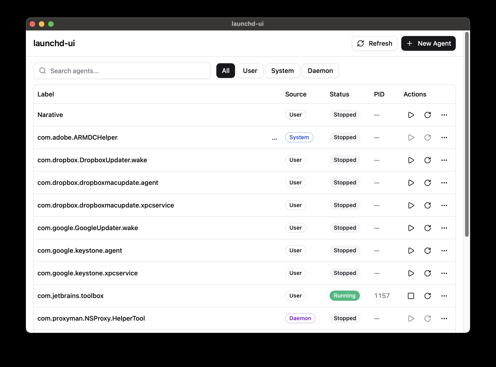

# launchd-ui

A GUI application for managing macOS launchd agents and daemons. Built with Tauri v2.

Browse user LaunchAgents (`~/Library/LaunchAgents/`) and system agents/daemons. Start, stop, restart, view/edit plist files, and create new agents.



## Tech Stack

- Tauri v2 (Rust backend) + React + TypeScript + Vite
- UI: Tailwind CSS v4 + shadcn/ui
- Lint: oxlint (TypeScript), cargo clippy + rustfmt (Rust)
- Test: vitest (Frontend), cargo test (Rust)
- Package manager: pnpm

## Development

```bash
# Install dependencies
pnpm install

# Dev mode (launches app with hot reload)
pnpm tauri:dev

# Frontend only
pnpm dev

# Production build (DMG)
pnpm tauri:build
```

## Testing / Lint

```bash
pnpm test          # vitest (frontend)
pnpm lint          # oxlint
pnpm typecheck     # TypeScript type check

cargo test --manifest-path src-tauri/Cargo.toml          # Rust tests
cargo fmt --manifest-path src-tauri/Cargo.toml --check   # Rust format check
cargo clippy --manifest-path src-tauri/Cargo.toml -- -D warnings  # Rust lint
```

## Install

This app is not code-signed. Use the following commands to download and install:

```bash
# Download the latest DMG (Apple Silicon)
curl -L -o /tmp/launchd-ui.dmg "https://github.com/azu/launchd-ui/releases/latest/download/launchd-ui_aarch64.dmg"
# Mount, copy, unmount
hdiutil attach /tmp/launchd-ui.dmg -mountpoint /tmp/launchd-ui-mount
cp -R /tmp/launchd-ui-mount/launchd-ui.app /Applications/
hdiutil detach /tmp/launchd-ui-mount
rm /tmp/launchd-ui.dmg
# Remove quarantine attribute (required for unsigned apps)
xattr -cr /Applications/launchd-ui.app
```

## License

MIT
